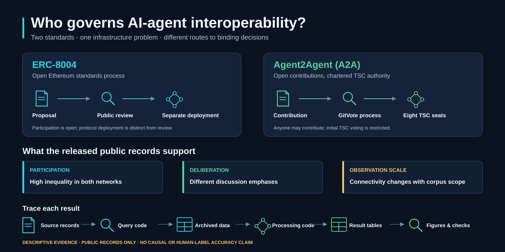
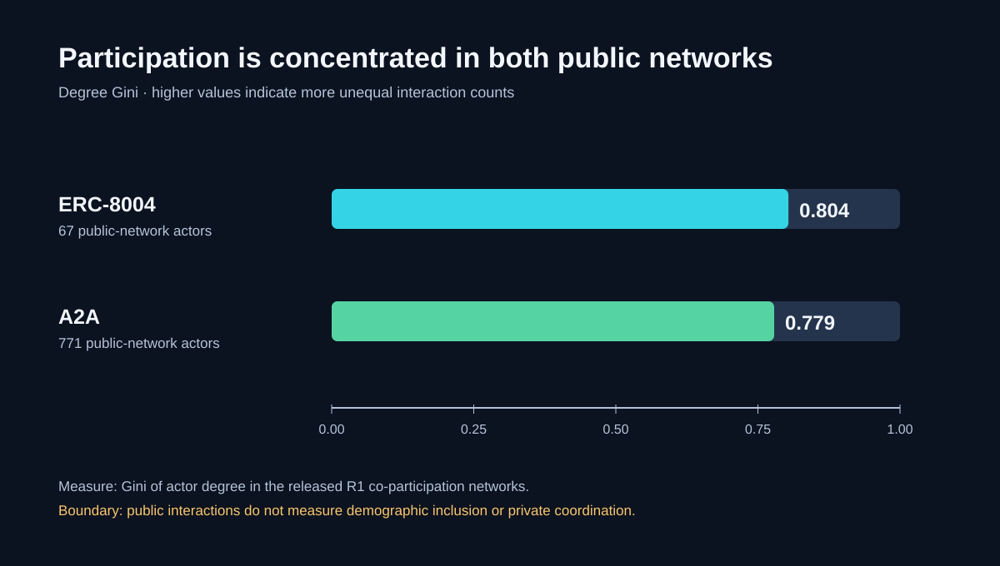
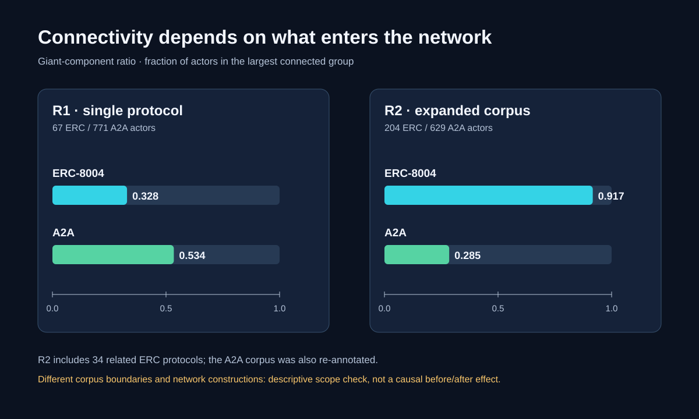
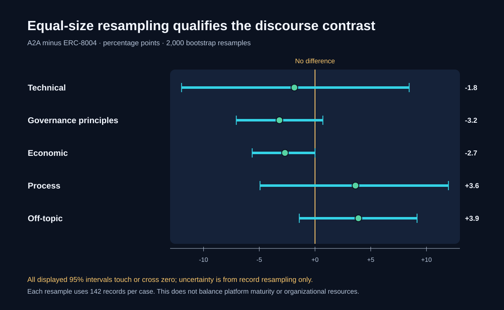

# Who governs AI-agent interoperability?



**An open computational case study for researchers in AI, organization studies, standards, and sustainable development.** The comparison follows public governance records for [ERC-8004](https://eips.ethereum.org/ERCS/erc-8004) and [Agent2Agent (A2A)](https://github.com/a2aproject/A2A). It examines formal authority, deliberation, participation, and network structure. The SVG above is a conceptual map, not an estimated effect.

**Start here:** [Reproduce the release](REPRODUCING.md) · [Inspect each result](RESULTS.md) · [Explore the figures](figures/README.md) · [Historical pipeline commands](WORKFLOW.md) · [See the data card](data/README.md) · [Cite the software](CITATION.cff)

## What the evidence says

| Question | Released observation | Important boundary |
|---|---|---|
| Who can participate and decide? | ERC-8004 has public proposal and review routes with deployment separate from standards discussion. A2A permits anyone to contribute, while its initial eight-seat Technical Steering Committee (TSC) holds formal voting authority. | A2A's 18-month charter provision concerns future TSC composition; it does **not** bar external contributions. EIP-1's rough-consensus provision is specific to Core EIPs, not a blanket description of ERC-8004. |
| Is participation concentrated? | R1 public-network degree Gini is **0.804** for ERC-8004 (67 actors) and **0.779** for A2A (771 actors). | Public interactions are neither demographic inclusion nor a complete record of private coordination. |
| Does connectivity change with scope? | R1 giant-component ratios are **0.328** (ERC-8004) and **0.534** (A2A). In R2, the expanded 34-ERC corpus is **0.917** and re-annotated A2A is **0.285**. | R1 and R2 use different corpora and network constructions. The change is a scope comparison, not a causal before/after effect. |
| Does equal-size sampling preserve an argument-type contrast? | Five A2A-minus-ERC point estimates and 95% intervals are shown in the bootstrap figure; all intervals touch or cross zero. | These are record-resampling intervals, with 142 records per case and 2,000 resamples. They do not control for maturity, platform, or organizational resources. |

Sources for the institutional descriptions: [EIP-1](https://eips.ethereum.org/EIPS/eip-1), [ERC-8004](https://eips.ethereum.org/ERCS/erc-8004), [A2A governance charter](https://github.com/a2aproject/A2A/blob/main/GOVERNANCE.md), and [A2A GitVote configuration](https://github.com/a2aproject/A2A/blob/main/.gitvote.yml). The linked live charters can change; the released tables describe the archived study period.

These are **descriptive observations** about public records. They do not establish a causal effect of governance form or measured outcomes for any Sustainable Development Goal. The project has no human gold-standard validation of the LLM labels and makes no label-accuracy claim. Cross-platform network ties are not perfectly harmonized.

## Figure gallery

| Figure | Preview | Exact inputs and scope |
|---|---|---|
| Participation inequality | [](figures/participation-inequality.svg) | R1 public-network metrics |
| Scope-dependent connectivity | [](figures/scope-connectivity.svg) | R1 and R2 network tables, shown in separate panels |
| Bootstrap argument differences | [](figures/argument-bootstrap.svg) | Frozen-manifest robustness table |

The gallery contains live-text, resolution-independent SVGs generated by [`scripts/visualise/build_release_figures.py`](scripts/visualise/build_release_figures.py). [`figures/manifest.json`](figures/manifest.json) records each input file's SHA-256, the output SHA-256, alt text, and interpretation boundary. No third-party logos or photos are embedded. Other existing analysis images remain in [`analysis/`](analysis/README.md); the four gallery figures are the checked, source-linked entry point.

## Reproduce

Install [Python 3.14+](https://www.python.org/) and [uv](https://docs.astral.sh/uv/). From a fresh checkout:

```bash
git clone https://github.com/sunshineluyao/erc8004-a2a-case-study.git
cd erc8004-a2a-case-study
uv sync --frozen
make verify
make figures-check
make reproduce
```

`make verify` validates the tracked code, metadata, tables, and repository boundary without a dataset download. `make figures-check` uses only Python's standard library to regenerate and compare the four SVGs and their provenance manifest. `make reproduce` downloads the **pinned** dataset snapshot and rebuilds the frozen R1 row manifest, Croissant data release, and five robustness tables before checking their expected counts and digests. It needs network access to the dataset host, but no model API key or GPU. See [REPRODUCING.md](REPRODUCING.md) for the stages, resource requirements, and live-source rerun distinction.

The dataset lives at [`kl41r3/erc8004-vs-a2a-governance`](https://huggingface.co/datasets/kl41r3/erc8004-vs-a2a-governance), pinned to commit [`987913bacae1a169bb39587b22dd002f74293177`](https://huggingface.co/datasets/kl41r3/erc8004-vs-a2a-governance/commit/987913bacae1a169bb39587b22dd002f74293177). Dataset payloads are ignored by Git. This fork did not create or rearchive that dataset.

## Find the evidence

| Location | Role |
|---|---|
| [`scripts/scrape/`](scripts/scrape/) | Provenance code for collecting public forum and repository records; live reruns can change. |
| [`scripts/process/`](scripts/process/) | Historical LLM annotation/consensus code and frozen R1 row-manifest/Croissant builders. |
| [`scripts/analyse/`](scripts/analyse/) | Network, topic, metric, and robustness analysis. |
| [`analysis/metrics/r1/`](analysis/metrics/r1/) and [`analysis/metrics/r2/`](analysis/metrics/r2/) | Tracked, distinct single-protocol and expanded-scope network tables. |
| [`analysis/metrics/neurips26/`](analysis/metrics/neurips26/) | Five tracked robustness tables and run summary. The directory name is historical, not a manuscript distribution. |
| [`figures/`](figures/README.md) | Hero, three evidence figures, checked SVG generation, and provenance manifest. |
| [`data/croissant/v1/`](data/croissant/v1/) | Tracked Croissant schema, release manifest, and checksums; large payloads download separately. |

The [result-to-code index](RESULTS.md) connects questions to the source snapshot, filtering/annotation stage, result tables, visualization code, and checks. The repository excludes LaTeX, manuscript files, private notes, credentials, and unreleased R3 outputs.

## Citation, reuse, and contact

Use [`CITATION.cff`](CITATION.cff) to cite this software fork. The [earlier upstream archive DOI](https://doi.org/10.5281/zenodo.21830235) identifies the upstream deposited version, **not** these later fork-only documentation and figure changes. The code is [MIT licensed](LICENSE); the dataset is [CC BY-NC 4.0](https://creativecommons.org/licenses/by-nc/4.0/) and public-source records retain their source terms. See [ASSET_LICENSES.md](ASSET_LICENSES.md) for the asset ledger. Research contact: Luyao Zhang, `lz183@duke.edu`.
